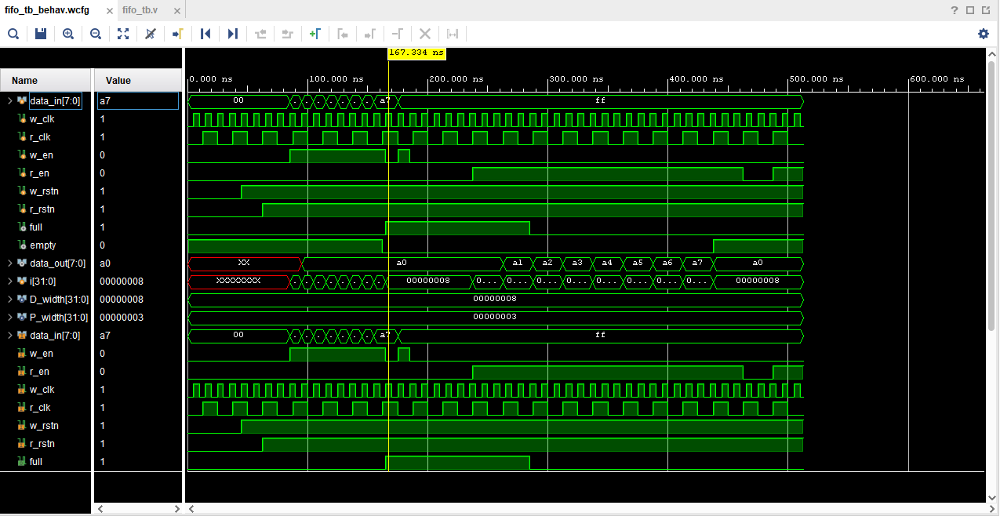

# Asynchronous FIFO Design & Verification

## 1. Project Overview
This repository contains a parameterizable, structural **Asynchronous (Dual-Clock) FIFO** implemented in Verilog. The design safely transfers multi-bit data between two completely independent clock domains (Write Clock and Read Clock) without risking data corruption or metastability.

### Key Specifications
* **Data Width (`D_width`):** 8 bits (Default)
* **Address Depth (`P_width`):** 8 words deep (3-bit address space + 1 extra bit for wrap-around detection)
* **Write Clock Domain:** 100 MHz ($10\text{ ns}$ period)
* **Read Clock Domain:** 40 MHz ($25\text{ ns}$ period)
* **Architecture Type:** First-Word Fall-Through (FWFT)

---

## 2. Architecture & Design Blocks
The design is split into modular components to reflect real-world ASIC/FPGA design principles:

* **`top_module.v`:** The structural wrapper interconnecting all sub-modules.
* **`fifo_memory.v`:** The dual-port RAM array holding the data, written using binary write pointers and read using binary read pointers.
* **`wr_ptr_handler.v`:** Manages the binary write pointer, converts it to Gray code, and generates the `full` flag locally. Contains overflow protection.
* **`r_ptr_handler.v`:** Manages the binary read pointer, converts it to Gray code, and generates the `empty` flag locally. Contains underflow protection.
* **`synchronizer.v`:** A standard 2-stage flip-flop structure used to pass the Gray-coded pointers safely across the Clock Domain Crossing (CDC) boundary.

---

## 3. Clock Domain Crossing (CDC) Strategy
To showcase engineering best practices, this design solves two fundamental CDC challenges:

1. **Metastability Mitigation:** Pointers cross domains via **2-Stage Register Synchronizers** to allow potential metastable outputs time to settle before being sampled.
2. **Multi-bit Convergence:** Direct binary pointer crossing can lead to illegal intermediate states due to net routing delays. Pointers are converted to **Gray Code** (where only 1 bit changes per transition) before crossing the domain boundary, ensuring the synchronizer captures either the exact old value or the exact new value.

### Flag Equations
* **Empty Condition:** Read pointer and synchronized write pointer are identical.
  $$\text{empty} = (g\_rptr == g\_wptr\_sync)$$
* **Full Condition:** Write pointer has wrapped around the address space exactly once, while the read pointer has not. In Gray code, this requires inverting the two most significant bits while matching the rest.
  $$\text{full} = (g\_wptr\_next == \{\sim g\_rptr\_sync[3:2], g\_rptr\_sync[1:0]\})$$

---

## 4. Verification & Waveform Analysis
The design was verified using behavioral simulation in AMD Vivado Simulator (XSim). 

### Key Functional Milestones Proven in Waveform:
1. **Reset State ($0\text{ ns} - 60\text{ ns}$):** Synchronous resets initialize pointers to zero. `empty` asserts high immediately.
2. **Burst Writes ($60\text{ ns} - 140\text{ ns}$):** Writing data elements `8'hA0` to `8'hA7` at 100 MHz. Due to the **First-Word Fall-Through (FWFT)** architecture, `8'hA0` appears on `data_out` automatically without requiring a read enable.
3. **Overflow Protection ($140\text{ ns} - 210\text{ ns}$):** The `full` flag asserts. A malicious write command (`8'hFF`) is attempted while full, and the design successfully blocks it, protecting memory integrity.
4. **CDC Flag Latency ($360\text{ ns} - 420\text{ ns}$):** The final data element is read out at 40 MHz. The `empty` flag de-asserts safely 2-3 read clock cycles *after* the FIFO is physically empty, showcasing the natural propagation delay of the 2-stage synchronizers.